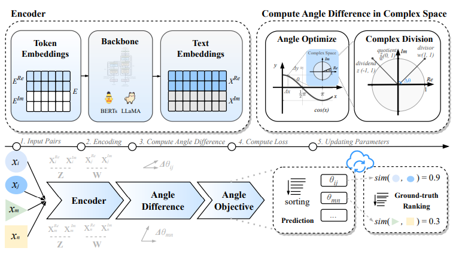
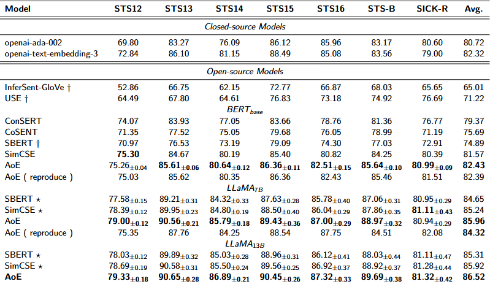
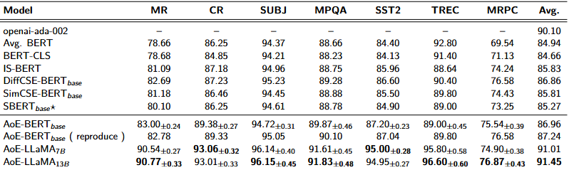
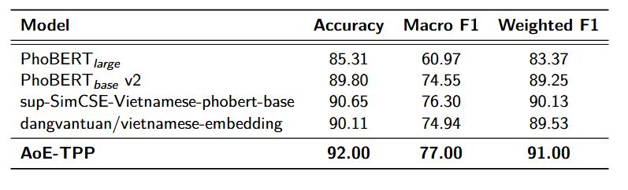

# Đồ án môn học CS221: AnglE-optimized Embeddings 📐
<p align="center">
  
</p>

**Về chi tiết cách sử dụng, mọi người có thể đọc tại 📘 tài liệu này:** https://angle.readthedocs.io/en/latest/index.html

📢 **Train/Infer Powerful Sentence Embeddings with AnglE.**

Có thể sử dụng thư viện để áp dụng vào bài toán khác 1 cách tiện lợi bằng cách tải thông qua: https://pypi.org/project/angle-emb/ hoặc lệnh pip install angle-emb

Thư viện này từ paper: [AnglE: Angle-optimized Text Embeddings](https://arxiv.org/abs/2309.12871).

## ✨ Cấu trúc thư mục

```
Angle_Embedding/
├── .gitignore              # Danh sách file/thư mục bị loại khỏi git
├── .python-version         # Phiên bản Python sử dụng cho dự án
├── .readthedocs.yaml       # Cấu hình build tài liệu trên ReadTheDocs
├── notebook/  
├── angle_emb/              # Thư viện chính: mã nguồn AnglE (model, trainer, loss, utils)
│   ├── __init__.py         # Khởi tạo package Python
│   ├── angle.py            # Định nghĩa lớp AnglE và các chức năng chính
│   ├── angle_trainer.py    # Module huấn luyện mô hình AnglE
│   ├── base.py             # Lớp cơ sở cho các mô hình embedding
│   ├── evaluation.py       # Đánh giá chất lượng embedding (Spearman, Pearson, ...)
│   ├── loss.py             # Định nghĩa các hàm loss (Angle, Contrastive, Espresso, ...)
│   ├── utils.py            # Các hàm tiện ích dùng chung
│   ├── version.py          # Thông tin phiên bản thư viện
├── assets/                 # Tài nguyên bổ sung (hình ảnh, biểu đồ, ...)
├── docs/                   # Tài liệu dự án (Sphinx, hướng dẫn, ghi chú, cấu hình)
│   ├── conf.py             # Cấu hình Sphinx
│   ├── index.rst           # Trang chủ tài liệu
│   ├── Makefile, make.bat  # Script build tài liệu
│   ├── requirements.txt    # Yêu cầu cài đặt cho tài liệu
│   └── notes/              # Các ghi chú, hướng dẫn chi tiết
├── en_results/             # Kết quả đánh giá mô hình tiếng Anh (json, báo cáo)
│   └── UAE-Large-V1/       # Kết quả cho model UAE-Large-V1
├── examples/               # Ví dụ sử dụng, notebook, script huấn luyện và đánh giá
│   ├── Angle-ATEC.ipynb    # Notebook ví dụ cho bộ dữ liệu ATEC
│   ├── Angle-BQ.ipynb      # Notebook ví dụ cho bộ dữ liệu BQ
│   ├── Angle-LCQMC.ipynb   # Notebook ví dụ cho bộ dữ liệu LCQMC
│   ├── Angle-PAWSX.ipynb   # Notebook ví dụ cho bộ dữ liệu PAWSX
│   ├── multigpu_infer.py   # Ví dụ inference đa GPU
│   ├── NLI/                # Ví dụ về Natural Language Inference
│   │   ├── SentEval/       # Bộ toolkit đánh giá embedding (SentEval)
│   │   │   ├── README.md   # Hướng dẫn sử dụng SentEval
│   │   │   ├── setup.py    # Cài đặt SentEval
│   │   │   └── senteval/   # Mã nguồn các task đánh giá (STS, SICK, probing, ...)
│   │   │       ├── probing.py
│   │   │       ├── sick.py
│   │   │       ├── sts.py
│   │   │       ├── engine.py
│   │   │       └── tools/
│   │   │           └── ranking.py
│   │   ├── eval_nli.py     # Script đánh giá NLI
│   │   ├── eval_ese_nli.py # Script đánh giá ESE NLI
│   │   ├── train_nli.py    # Script huấn luyện NLI
│   │   └── data/           # Script tải dữ liệu NLI
│   │       └── download_data.sh
│   └── UAE/                # Ví dụ về Universal AnglE Embeddings
│       ├── README.md
│       ├── compute_scores.py # tính điểm
│       ├── emb_model.py
│       ├── run_eval_mteb.py # Đánh giá trên MTEB
│       └── train.py # Huấn luyện mô hình
├── LICENSE                 # Giấy phép sử dụng mã nguồn (MIT)
├── MIGRATION_GUIDE.md      # Hướng dẫn nâng cấp phiên bản mới nhất
├── pyproject.toml          # Cấu hình build và metadata dự án Python
├── README.md               # Giới thiệu về đồ án
├── README_2DMSE.md         # Tài liệu về 2D Matryoshka Sentence Embeddings
├── README_ESE.md           # Tài liệu về Espresso Sentence Embeddings
├── README_zh.md            # Tài liệu tiếng Trung
├── requirements.txt        # Yêu cầu cài đặt Python cho dự án
├── ruff.toml               # Cấu hình linting với ruff
├── scripts/                # Script tiện ích, chuyển đổi mô hình, xử lý dữ liệu
│   └── convert_to_sentence_transformer.py
├── tests/                  # test thử mô hình nhanh
```


**Backbones**:
- BERT-based models (BERT, RoBERTa, ModernBERT, etc.)
- LLM-based models (LLaMA, Mistral, Qwen, etc.)
- Bi-directional LLM-based models (LLaMA, Mistral, Qwen, OpenELMo, etc.. refer to: https://github.com/WhereIsAI/BiLLM)

**Training**:
- Single-GPU training
- Multi-GPU training


## 🛠️ Cài đặt
### Sử dụng Conda

```bash
git clone https://github.com/BPhucKHMT/Angle_Embedding.git
cd Angle_Embedding

# Tạo environment mới với Python 3.10
conda create -n angle python=3.10 -y

# Kích hoạt environment
conda activate angle

pip install -e .
```


## 🚀 Thực nghiệm 

### STS Benchmark
#### A) Cách 1: Sử dụng pretrain models của tác giả
Sử dụng các model đã pretrain dưới đây để đánh giá nhanh
##### 🤗 HF Pretrained Models

[AnglE NLI Sentence Embedding](https://huggingface.co/collections/SeanLee97/angle-nli-sentence-embeddings-6646de386099d0472c5e21c0)

##### English STS Results

| Model | STS12 | STS13 | STS14 | STS15 | STS16 | STSBenchmark | SICKRelatedness |  Avg. |
| ------- |-------|-------|-------|-------|-------|--------------|-----------------|-------|
| [SeanLee97/angle-llama-7b-nli-20231027](https://huggingface.co/SeanLee97/angle-llama-7b-nli-20231027) | 78.68 | 90.58 | 85.49 | 89.56 | 86.91 |    88.92     |      81.18      | 85.90 |
| [SeanLee97/angle-llama-7b-nli-v2](https://huggingface.co/SeanLee97/angle-llama-7b-nli-v2) | 79.00 | 90.56 | 85.79 | 89.43 | 87.00 |    88.97     |      80.94      | 85.96 |
| [SeanLee97/angle-llama-13b-nli](https://huggingface.co/SeanLee97/angle-llama-13b-nli)  | 79.33 | 90.65 | 86.89 | 90.45 | 87.32 |    89.69     |      81.32       | **86.52** |
| [SeanLee97/angle-bert-base-uncased-nli-en-v1](https://huggingface.co/SeanLee97/angle-bert-base-uncased-nli-en-v1) | 75.09 | 85.56 | 80.66 | 86.44 | 82.47 | 85.16 | 81.23 | 82.37 |
---

**BERT**

```bash
python eval_nli.py \
--model_name_or_path SeanLee97/angle-bert-base-uncased-nli-en-v1 \
--pooling_strategy cls_avg
```
**LLM-based**

```bash
python eval_nli.py \
--model_name_or_path SeanLee97/angle-llama-7b-nli-v2 \
--pooling_strategy cls_avg
```

**BERT-BASE cho downstream task**

```bash
python eval_ese_nli.py \
  --model_name_or_path SeanLee97/angle-bert-base-uncased-nli-en-v1 \
  --pooling_strategy cls_avg \
  --mode test \
  --task_set transfer
```

#### B) Cách 2: Huấn luyện NLI cho STS Benchmark
##### 1. Chuẩn bị gpu enviroment

##### 2. Cài đặt angle_emb

```bash
python -m pip install -U angle_emb
$ cd examples/NLI
```
##### 3. Tải xuống và chuẩn bị dữ liệu

###### 3.1 Tải xuống dữ liệu multi_nli + snli:

các nli datasets sẽ có 3 cột gồm các premise, hypothesis, label

```bash
$ cd data
$ sh download_data.sh
```

###### 3.2 Tải xuống STS datasets

các sts datasets sẽ có 3 cột tương ứng sentence1 , sentence2, score

```bash
$
$ cd SentEval/data/downstream
$ bash download_dataset.sh
```
###### 3.3 Chuẩn hóa lại format
- Dữ liệu đã được chuẩn hóa trong code thành dạng 'text1', 'text2', 'label'

##### 4. Training
###### 4.1 Bert
train:

```bash
python -m angle_emb.angle_trainer \
--train_name_or_path SeanLee97/all_nli_angle_format_a \
--save_dir ckpts/bert-base-nli-test \
--model_name_or_path google-bert/bert-base-uncased \
--pooling_strategy cls \
--maxlen 128 \
--ibn_w 30.0 \
--cosine_w 0.0 \
--angle_w 1.0 \
--angle_tau 20.0 \
--learning_rate 5e-5 \
--warmup_steps 50 \
--batch_size 128 \
--seed 42 \
--gradient_accumulation_steps 16 \
--epochs 10 \
--fp16 1
```
eval: 
```bash
 python eval_nli.py \
--model_name_or_path SeanLee97/bert-base-nli-test-0728 \
--pooling_strategy cls_avg
```

###### 4.2 LLM-based
train: 

```bash
python -m angle_emb.angle_trainer \
--model_name_or_path NousResearch/Llama-2-7b-hf \
--train_name_or_path SeanLee97/all_nli_angle_format_b \
--save_dir ckpts/NLI-STS-angle-llama-7b \
--query_prompt 'Summarize sentence "{text}" in one word:"' \
--is_llm 1 \
--apply_lora 1 \
--w2 35 --learning_rate 1e-4 --maxlen 50 \
--lora_r 32 --lora_alpha 32 --lora_dropout 0.1 \
--batch_size 120 --seed 42 --do_eval 0 --load_kbit 4 --gradient_accumulation_steps 4 --epochs 1
```

eval:

```bash
 python eval_nli.py \
--model_name_or_path NousResearch/Llama-2-7b-hf \
--lora_name_or_path SeanLee97/angle-llama-7b-nli \
--pooling_strategy last \
--is_llm 1
```

## Kết quả đánh giá thực nghiệm

<p align="center">
  
   <br>
  <em>Standard STS tasks</em>
</p>


<p align="center">
  
   <br>
  <em>Downstream classification tasks</em>
</p>

## 🕸️ Custom Training (Trên notebook demo)

### Notebook Train_AOE_vietnamese.ipynb

#### Backbone

Sử dụng backbone phobert-base-v2 thay cho bert-base

#### Dữ liệu huấn luyện

Mô hình được train 2 lần thông qua 2 bộ dataset:

**1) Dataset: anti-ai/ViNLI-SimCSE-supervised_v2**

Dataset gồm 3 cột : Anchor( câu gốc), Entailment (câu suy diễn), Contradiction(câu mâu thuẫn)

Sau khi đổi lại format: 'query', 'pos', 'hard_neg'

**2) Dataset: doanhieung/stsbenchmark-sts-vi**

Dataset gồm 3 cột: sentence1, sentence2, score

Sau khi đổi lại format: 'text1', 'text2', 'label'

### Notebook AoE_Sentiment_Analysis.ipynb

So sánh AoE đã pretrain trên 2 datasets với các embedding PhoBert, sup-SimCSE-Vietnamese-phobert-base, dangvantuan/vietnamese-embedding trên **task sentiment analysis**

#### Dữ liệu huấn luyện

**Dataset: uitnlp/vietnamese_students_feedback** 

Dữ liệu gồm 2 cột chính: sentence và sentiment ( postive, negative, neutral)

Dữ liệu gồm 11426 dòng cho train và 3166 dòng cho test

#### Độ đo sử dụng
 Accuracy, F1-score, 

## Bảng so sánh giữa các model trên task sentiment analysis

<p align="center">
  
   <br>
  <em>Sentiment analysis </em>
</p>
