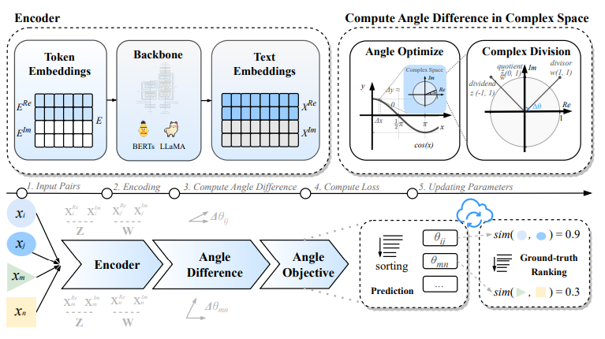
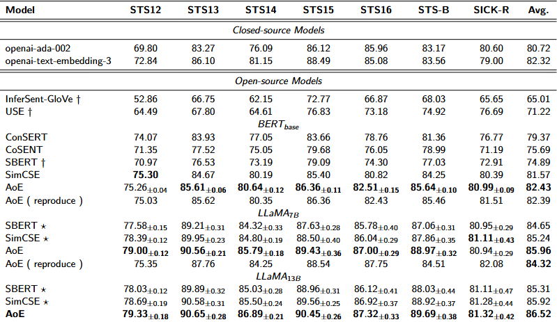
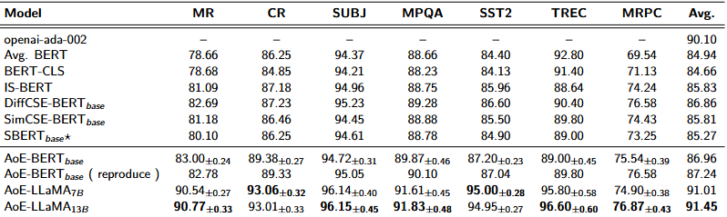
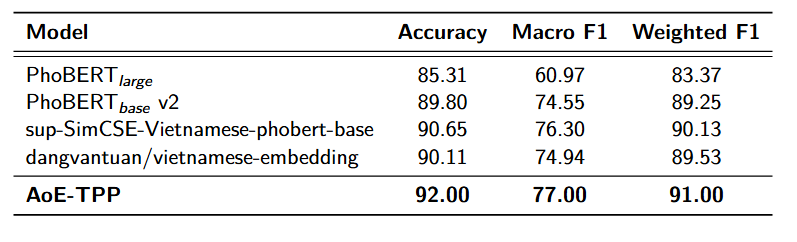

# 📐 Đồ án môn học CS221: AnglE-optimized Embeddings

<div align="center">
  
  
  [](https://angle.readthedocs.io/en/latest/index.html)
  [](https://pypi.org/project/angle-emb/)
  [](https://arxiv.org/abs/2309.12871)
</div>

---

## 📖 Giới thiệu

**Train/Infer Powerful Sentence Embeddings with AnglE.**

Thư viện mạnh mẽ để huấn luyện và suy luận sentence embeddings dựa trên phương pháp AnglE (Angle-optimized Text Embeddings). Có thể tích hợp dễ dàng vào các bài toán NLP khác nhau.

**📘 Tài liệu chi tiết:** https://angle.readthedocs.io/en/latest/index.html

**📦 Cài đặt nhanh để sử dụng vào 1 bài toán khác:**
```bash
pip install angle-emb
```

**📄 Paper gốc:** [AnglE: Angle-optimized Text Embeddings](https://arxiv.org/abs/2309.12871)

---

## ✨ Cấu trúc thư mục

```
Angle_Embedding/
│
├── 📄 .gitignore              # Danh sách file/thư mục bị loại khỏi git
├── 🐍 .python-version         # Phiên bản Python sử dụng cho dự án
├── 📚 .readthedocs.yaml       # Cấu hình build tài liệu trên ReadTheDocs
│
├── 📓 notebook/               # Jupyter notebooks demo
│   ├── AOE_Sentiment_Analysis.ipynb           # Ứng dụng vào bài toán sentiment analysis
│   ├── Train_AOE_vietnamese.ipynb         #pretrain trên dataset tiếng việt
│
├── 🔧 angle_emb/              # Thư viện chính: mã nguồn AnglE
│   ├── __init__.py           # Khởi tạo package Python
│   ├── angle.py              # Định nghĩa lớp AnglE và các chức năng chính
│   ├── angle_trainer.py      # Module huấn luyện mô hình AnglE
│   ├── base.py               # Lớp cơ sở cho các mô hình embedding
│   ├── evaluation.py         # Đánh giá chất lượng embedding
│   ├── loss.py               # Định nghĩa các hàm loss
│   ├── utils.py              # Các hàm tiện ích dùng chung
│   └── version.py            # Thông tin phiên bản thư viện
│
├── 🖼️ assets/                 # Tài nguyên bổ sung (hình ảnh, biểu đồ)
│
├── 📖 docs/                   # Tài liệu dự án
│   ├── conf.py               # Cấu hình Sphinx
│   ├── index.rst             # Trang chủ tài liệu
│   ├── Makefile, make.bat    # Script build tài liệu
│   ├── requirements.txt      # Yêu cầu cài đặt cho tài liệu
│   └── notes/                # Các ghi chú, hướng dẫn chi tiết
│
├── 📊 en_results/             # Kết quả đánh giá mô hình tiếng Anh
│   └── UAE-Large-V1/         # Kết quả cho model UAE-Large-V1
│
├── 💡 examples/               # Ví dụ sử dụng, notebook, script
│   ├── Angle-ATEC.ipynb      # Notebook ví dụ cho bộ dữ liệu ATEC
│   ├── Angle-BQ.ipynb        # Notebook ví dụ cho bộ dữ liệu BQ
│   ├── Angle-LCQMC.ipynb     # Notebook ví dụ cho bộ dữ liệu LCQMC
│   ├── Angle-PAWSX.ipynb     # Notebook ví dụ cho bộ dữ liệu PAWSX
│   ├── multigpu_infer.py     # Ví dụ inference đa GPU
│   │
│   ├── NLI/                  # Natural Language Inference
│   │   ├── SentEval/         # Bộ toolkit đánh giá embedding
│   │   │   ├── README.md
│   │   │   ├── setup.py
│   │   │   └── senteval/     # Mã nguồn các task đánh giá
│   │   │       ├── probing.py
│   │   │       ├── sick.py
│   │   │       ├── sts.py
│   │   │       ├── engine.py
│   │   │       └── tools/
│   │   │           └── ranking.py
│   │   ├── eval_nli.py       # Script đánh giá NLI
│   │   ├── eval_ese_nli.py   # Script đánh giá ESE NLI
│   │   ├── train_nli.py      # Script huấn luyện NLI
│   │   └── data/             # Script tải dữ liệu NLI
│   │       └── download_data.sh
│   │
│   └── UAE/                  # Universal AnglE Embeddings
│       ├── README.md
│       ├── compute_scores.py # Tính điểm
│       ├── emb_model.py
│       ├── run_eval_mteb.py  # Đánh giá trên MTEB
│       └── train.py          # Huấn luyện mô hình
│
├── 📜 LICENSE                 # Giấy phép sử dụng mã nguồn (MIT)
├── 📝 MIGRATION_GUIDE.md      # Hướng dẫn nâng cấp phiên bản
├── ⚙️ pyproject.toml          # Cấu hình build và metadata dự án
├── 📄 README.md               # Giới thiệu về đồ án
├── 📄 README_2DMSE.md         # Tài liệu về 2D Matryoshka Sentence Embeddings
├── 📄 README_ESE.md           # Tài liệu về Espresso Sentence Embeddings
├── 📄 README_zh.md            # Tài liệu tiếng Trung
├── 📋 requirements.txt        # Yêu cầu cài đặt Python cho dự án
├── 🔍 ruff.toml               # Cấu hình linting với ruff
├── 🛠️ scripts/                # Script tiện ích, chuyển đổi mô hình
│   └── convert_to_sentence_transformer.py
└── 🧪 tests/                  # Test thử mô hình nhanh
```

---
# AnglE Embedding - Vietnamese NLP Project

Dự án training và đánh giá AnglE embedding models cho tiếng Việt:
- **Train_AOE_vietnamese.ipynb**: Train model với triplet learning + fine-tune trên STS benchmark
- **AoE_Sentiment_Analysis.ipynb**: So sánh hiệu suất các embedding models trên sentiment analysis

---

## Notebook 1: Train_AOE_vietnamese.ipynb


### Cấu hình MLflow
```python
import dagshub
dagshub.init(repo_owner='baophuc2005', repo_name='aoe-tpp', mlflow=True)

mlflow.set_tracking_uri("https://dagshub.com/baophuc2005/aoe-tpp.mlflow")
mlflow.set_experiment("angle-triplet")
```

### Datasets

**Round 1: Triplet Learning**
- Dataset: `anti-ai/ViNLI-SimCSE-supervised_v2`
- Format: anchor, positive, hard_negative
- Split: 95% train / 5% validation

**Round 2: STS Fine-tuning**
- Dataset: `doanhieung/stsbenchmark-sts-vi`
- Format: sentence pairs với similarity score (0-1)
- Split: 90% train / 10% validation

**Evaluation**
- Dataset: `anti-ai/ViSTS` (6 subsets: STS-B, STS-Sickr, STS12-15)
- Metric: Spearman correlation

### Hyperparameters

**Round 1 (Triplet Training)**
- Base model: `vinai/phobert-base-v2`
- Batch size: 256
- Epochs: 5
- Learning rate: 2e-5
- Warmup steps: 200
- Pooling: CLS token
- Loss weights: cosine_w=1.0, ibn_w=1.0, angle_w=0.02
- Output: `checkpoints/best_model_final`

**Round 2 (STS Fine-tuning)**
- Base model: `checkpoints/best_model_final`
- Batch size: 64
- Epochs: 10
- Learning rate: 1e-5
- Warmup steps: 0
- Loss weights: cosine_w=1.0, ibn_w=1.0, angle_w=0.02
- Output: `checkpoints/best_model_sts_completev2`

### Cách chạy
Chạy tuần tự các cells trong notebook. Training progress được track trên [MLflow UI](https://dagshub.com/user-name/repo-name.mlflow).

---

## Notebook 2: AoE_Sentiment_Analysis.ipynb

### Dataset
- Dataset: `uitnlp/vietnamese_students_feedback` (UIT-VSFC)
- Task: Sentiment classification (3 classes)
- Labels: 0=Tiêu cực, 1=Trung tính, 2=Tích cực
- Splits: train, test

### Models được test
1. `VoVanPhuc/sup-SimCSE-VietNamese-phobert-base`
2. `dangvantuan/vietnamese-embedding`
3. `vinai/phobert-base-v2`
4. `vinai/phobert-large`
5. Model AnglE đã train (load từ MLflow với RUN_ID: `your-run-id`)

### Phương pháp đánh giá
- Extract embeddings từ models (CLS pooling, batch_size=32)
- Train Logistic Regression classifier
- Đánh giá: Precision, Recall, F1-score

### Cách chạy
Chạy lần lượt các cells để test từng model. GPU được tự động sử dụng nếu có sẵn

---


## 🛠️ Cài đặt

### Sử dụng Conda

```bash
# Clone repository
git clone https://github.com/BPhucKHMT/Angle_Embedding.git
cd Angle_Embedding

# Tạo environment mới với Python 3.10
conda create -n angle python=3.10 -y

# Kích hoạt environment
conda activate angle

# Cài đặt
pip install -e .
```

---

## 🚀 Thực nghiệm

### 📊 STS Benchmark

#### A) **Cách 1: Sử dụng pretrained models**

##### 🤗 HF Pretrained Models

Tham khảo: [AnglE NLI Sentence Embedding Collection](https://huggingface.co/collections/SeanLee97/angle-nli-sentence-embeddings-6646de386099d0472c5e21c0)

##### 📈 English STS Results

| Model | STS12 | STS13 | STS14 | STS15 | STS16 | STSBenchmark | SICKRelatedness | Avg. |
|-------|-------|-------|-------|-------|-------|--------------|-----------------|------|
| [angle-llama-7b-nli-20231027](https://huggingface.co/SeanLee97/angle-llama-7b-nli-20231027) | 78.68 | 90.58 | 85.49 | 89.56 | 86.91 | 88.92 | 81.18 | 85.90 |
| [angle-llama-7b-nli-v2](https://huggingface.co/SeanLee97/angle-llama-7b-nli-v2) | 79.00 | 90.56 | 85.79 | 89.43 | 87.00 | 88.97 | 80.94 | 85.96 |
| [angle-llama-13b-nli](https://huggingface.co/SeanLee97/angle-llama-13b-nli) | 79.33 | 90.65 | 86.89 | 90.45 | 87.32 | 89.69 | 81.32 | **86.52** |
| [angle-bert-base-uncased-nli-en-v1](https://huggingface.co/SeanLee97/angle-bert-base-uncased-nli-en-v1) | 75.09 | 85.56 | 80.66 | 86.44 | 82.47 | 85.16 | 81.23 | 82.37 |

---

**Đánh giá BERT:**

```bash
python eval_nli.py \
  --model_name_or_path SeanLee97/angle-bert-base-uncased-nli-en-v1 \
  --pooling_strategy cls_avg
```

**Đánh giá LLM-based:**

```bash
python eval_nli.py \
  --model_name_or_path SeanLee97/angle-llama-7b-nli-v2 \
  --pooling_strategy cls_avg
```

**Đánh giá BERT-BASE cho downstream task:**

```bash
python eval_ese_nli.py \
  --model_name_or_path SeanLee97/angle-bert-base-uncased-nli-en-v1 \
  --pooling_strategy cls_avg \
  --mode test \
  --task_set transfer
```

---

#### B) **Cách 2: Huấn luyện NLI cho STS Benchmark**

##### 1️⃣ Chuẩn bị GPU environment

##### 2️⃣ Cài đặt angle_emb

```bash
python -m pip install -U angle_emb
cd examples/NLI
```

##### 3️⃣ Tải xuống và chuẩn bị dữ liệu

**3.1 Tải xuống dữ liệu multi_nli + snli:**

Các NLI datasets sẽ có 3 cột: `premise`, `hypothesis`, `label`

```bash
cd data
sh download_data.sh
```

**3.2 Tải xuống STS datasets:**

Các STS datasets sẽ có 3 cột: `sentence1`, `sentence2`, `score`

```bash
cd SentEval/data/downstream
bash download_dataset.sh
```

**3.3 Chuẩn hóa lại format:**

Dữ liệu đã được chuẩn hóa trong code thành dạng: `'text1'`, `'text2'`, `'label'`

##### 4️⃣ Training

**4.1 BERT**

Train:

```bash
python -m angle_emb.angle_trainer \
  --train_name_or_path SeanLee97/all_nli_angle_format_a \
  --save_dir ckpts/bert-base-nli-test \
  --model_name_or_path google-bert/bert-base-uncased \
  --pooling_strategy cls \
  --maxlen 128 \
  --ibn_w 30.0 \
  --cosine_w 0.0 \
  --angle_w 1.0 \
  --angle_tau 20.0 \
  --learning_rate 5e-5 \
  --warmup_steps 50 \
  --batch_size 128 \
  --seed 42 \
  --gradient_accumulation_steps 16 \
  --epochs 10 \
  --fp16 1
```

Eval:

```bash
python eval_nli.py \
  --model_name_or_path SeanLee97/bert-base-nli-test-0728 \
  --pooling_strategy cls_avg
```

**4.2 LLM-based**

Train:

```bash
python -m angle_emb.angle_trainer \
  --model_name_or_path NousResearch/Llama-2-7b-hf \
  --train_name_or_path SeanLee97/all_nli_angle_format_b \
  --save_dir ckpts/NLI-STS-angle-llama-7b \
  --query_prompt 'Summarize sentence "{text}" in one word:"' \
  --is_llm 1 \
  --apply_lora 1 \
  --w2 35 --learning_rate 1e-4 --maxlen 50 \
  --lora_r 32 --lora_alpha 32 --lora_dropout 0.1 \
  --batch_size 120 --seed 42 --do_eval 0 --load_kbit 4 \
  --gradient_accumulation_steps 4 --epochs 1
```

Eval:

```bash
python eval_nli.py \
  --model_name_or_path NousResearch/Llama-2-7b-hf \
  --lora_name_or_path SeanLee97/angle-llama-7b-nli \
  --pooling_strategy last \
  --is_llm 1
```

---

## 📊 Kết quả đánh giá thực nghiệm

<div align="center">
  
  <p><em>Standard STS tasks</em></p>
</div>

<div align="center">
  
  <p><em>Downstream classification tasks</em></p>
</div>

---

## 🕸️ Custom Training (Trên notebook demo)

### 📓 Notebook: Train_AOE_vietnamese.ipynb

#### 🔧 Backbone

Sử dụng backbone **phobert-base-v2** thay cho bert-base

#### 📚 Dữ liệu huấn luyện

Mô hình được train 2 lần thông qua 2 bộ dataset:

**1) Dataset: anti-ai/ViNLI-SimCSE-supervised_v2**

- Dataset gồm 3 cột: `Anchor` (câu gốc), `Entailment` (câu suy diễn), `Contradiction` (câu mâu thuẫn)
- Sau khi đổi lại format: `'query'`, `'pos'`, `'hard_neg'`

**2) Dataset: doanhieung/stsbenchmark-sts-vi**

- Dataset gồm 3 cột: `sentence1`, `sentence2`, `score`
- Sau khi đổi lại format: `'text1'`, `'text2'`, `'label'`

### 📏  Độ đo sử dụng

- Các độ đo như lúc paper test với bộ dữ liệu tiếng anh ở trên

---

### 📓 Notebook: AoE_Sentiment_Analysis.ipynb

So sánh AoE đã pretrain trên 2 datasets với các embedding:
- PhoBert
- sup-SimCSE-Vietnamese-phobert-base
- dangvantuan/vietnamese-embedding

Trên **task sentiment analysis**

#### 📚 Dữ liệu huấn luyện

**Dataset: uitnlp/vietnamese_students_feedback**

- Dữ liệu gồm 2 cột chính: `sentence` và `sentiment` (positive, negative, neutral)
- Dữ liệu gồm **11,426 dòng** cho train và **3,166 dòng** cho test

#### Model sử dụng để phân loại

-Ứng dụng logistic regression cho mọi embedding

#### 📏 Độ đo sử dụng

- Accuracy
- F1-score

---

## 🏆 Bảng so sánh giữa các model trên task sentiment analysis

<div align="center">
  
  <p><em>Sentiment analysis comparison</em></p>
</div>

---

## 📝 Citation

```bibtex
@article{li2023angle,
  title={AnglE-optimized Text Embeddings},
  author={Li, Xianming and Li, Jing},
  journal={arXiv preprint arXiv:2309.12871},
  year={2023}
}
```
